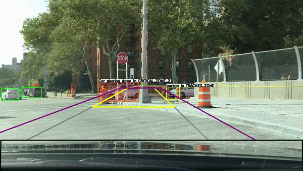

<h2> This feature responsible for analyzes camera feeds to detect and interpret visual data. </h2>

<h4>Build with passion by image processing team: </h4>
 <ul><li>David Maroko</li> <li>Mendel Bismuth</li> <li>Elimelech Shuvaks</li>  <li>Aron Jochnovitch</li></ul>

To run separately this feature, follow these instructions:

1. Connect to GitHub and download the branch `MidIntegration`.

2. Navigate to the folder `VeichleCompSim > ImageProcessing > CMakeProjectOPENCV > data`.

3. Download and extract the following folder into it:

https://drive.google.com/file/d/10l3b44mZ22tT-GPQNUBuW5-KwB82cjVB/view?usp=sharing

You should now have 3 subfolders inside the `data` folder.

4. Go back one folder above, and create a `Build` folder.
   
5. Enter the `Build` folder and build as a CMake project by running the following command:
```bash
cmake ..
```

(our system run of both: debug and release, but the communication server currently run on release,
so debug mode will not work)

For Release mode: 
```bash
cmake --build . --config Release
```
For Debug mode: 
```bash
cmake --build .
```
Now, go into the Debug subfolder created during the build process, and run the MyApp.exe file.

---------------------------------------------------------------------
Note: We used the following files from external projects:

1. `yolov3.weights` from the YOLOv3 project, licensed under the Apache License 2.0.
   - Full license: http://www.apache.org/licenses/LICENSE-2.0
   - Original project: https://github.com/patrick013/Object-Detection---Yolov3

2. `coco.names` from the Darknet project, licensed under the MIT License.
   - Full license: https://opensource.org/licenses/MIT
   - Original project: https://github.com/pjreddie/darknet

3. `yolov3.cfg` from the Darknet project, licensed under the MIT License.
   - Full license: https://opensource.org/licenses/MIT
   - Original project: https://github.com/pjreddie/darknet
